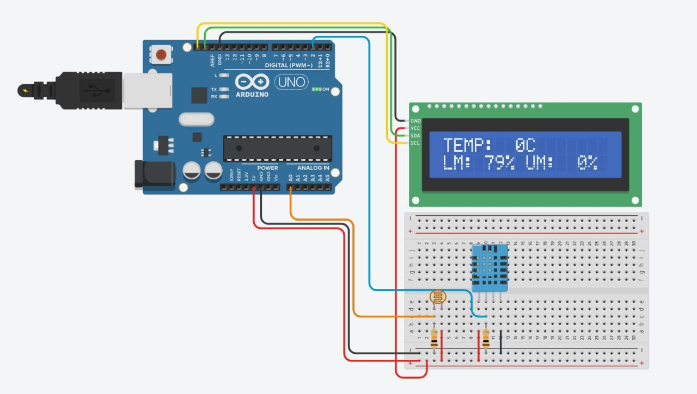
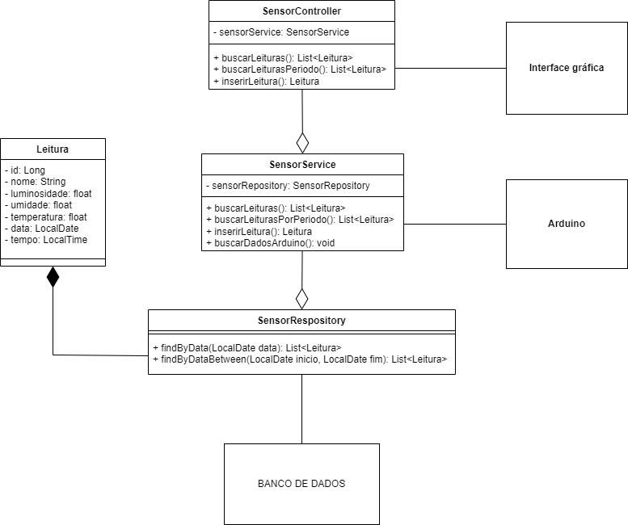
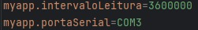
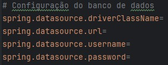

# LUT-Sensor - Projeto de sensores de Luz, Umidade e Temperatura.

## Introdução

Um projeto simples de arduino com integração ao Java, e interface visual para dispositivo móveis. Projeto Integrador da faculdade, onde usaremos conceitos de IoT das disciplinas de tecnologias emergentes e ferramentas visuais.

## Motivação e Proposta

Marcos é um estudante de Análise e Desenvolvimento de Sistemas
que recentemente adquiriu uma casa antiga com a intenção de modernizá-
la. Ele decidiu transformar sua nova residência em um **ambiente**
**inteligente**, onde pudesse monitorar e controlar diversos aspectos do
ambiente, como temperatura, umidade e iluminação, de maneira eficiente
e integrada. 
<br/>
Ao planejar essa transformação, Marcos identificou a necessidade de
um sistema que não apenas coletasse dados em tempo real sobre as
condições ambientais de sua casa, mas que também permitisse visualizar e
analisar esses dados de forma intuitiva. Para isso, ele precisava de um
sistema que integrasse sensores de IoT e uma interface de usuário
amigável.

Inspirado pela necessidade de Marcos, decidimos desenvolver um projeto ao qual inclua os seguintes componentes:

- Um esquema ilustrativo de um [protótipo utilizando Arduino UNO](#protótipo-utilizando-arduino-uno), utilizando sensores de temperatura, umidade e luminosidade que serão integrados à placa. Incluindo os códigos utilizados na placa.
- Um [módulo programado em  Java](#módulo-programado-em-java) para receber e processar os dados coletados pelos sensores dispostos no esquema, exibindo-os na medida que são lidos. Incluindo um diagrama de classes UML que ilustra a arquitetura e os componentes do sistema.
- um [protótipo de interface gráfica](#protótipo-de-interface-gráfica) para o sistema de monitoramento

## Desenvolvimento

Nossa missão com esse projeto é integrar três conceitos ao qual esta relacionado à internet das coisas, Big Data e interface de usuários. Tivemos a ideia de deixar o projeto simples e flexível para que fique possível pequenas adaptações, e para isso tivemos a ideia de realizar o módulo programdo em Java no formato de um API REST, assim conseguimos consultar os dados para a interface gráfica, e inserir dados para caso o usuário deseje inserir um módulo wi-fi no Arduino, assim enviando os dados via requisição HTTP e possibilitando o uso de vários medidores de ambiente na mesma rede local. Também escolhemos guardar os dados em um banco de dados para que assim possamos ter um registro de leituras e posteriormente possibilitando realizar cálculos como média de temperatura ao longo do mês.

Usaremos do framework Spring boot por sua facilidade em processos trabalhosos e usaremos também Spring JPA e Lombok para tornar a escrita do módulo programado em java mais fácil de descomplicada. Para o Arduino utilizaremos o Tinkercad para prototipar e programar um Arduino simulado pela facilidade e segurança dos equipamentos, o mesmo serve para a interface gráfica com ferramentas como Figma ou Quant-UX.

## Protótipo utilizando Arduino UNO

O protótipo segue um esquema simples onde teremos os sensores DHT11 e LDR para realizar a medição de luminosidade, umidade e temperatura, onde teremos uma conexão contínua com o computador que irá resgatar os dados do Arduino e guardar em um banco de dados. Adicionalmente teremos também uma tela LCD para uma visualização rápida e em tempo real para o usuário, a leitura segue um delay de dois segundos, de acordo com a recomendação para utilização do DHT11. Segue abaixo o esquema do protótipo:



Implementamos uma simulação do protótipo rodando no Tinkercad, onde não temos o DHT11, porém utilizamos um módulo TMP e um Potenciômetro para simular as saídas de dados, [link para o protótipo no Tinkercad](https://www.tinkercad.com/things/aHcX8JOR35W-lut-sensor). Na parte do código usamos a porta Serial para envio de um String de JSON que será captado e convertido em um objeto no módulo programado em Java, você consegue observar e baixar o código do Arduino [aqui](./arduino/code/code.ino). Também você consegue adquirir as bibliotecas usadas listados abaixo: 

- [Adafruit_LiquidCrystal](https://github.com/adafruit/Adafruit_LiquidCrystal)
- [DHT-sensor-library](https://github.com/adafruit/DHT-sensor-library)

## Módulo programado em Java



Diagrama de classes feito usando o programa [draw.io](draw.io). Você consegue encontrar o arquivo do programa [aqui](./resources/javaDiagram.drawio).

O módulo programado em Java seguirá o modelo de uma API, onde a cada algum período escolhido a aplicação irá puxar os dados do Arduino conectado direto à máquina. A API seguirá o fluxo simples de solicitar os dados via requisição http, onde a API irá puxar os dados do banco de dados tratados, mostrando ou todas as leituras, ou leituras em um período de tempo.

Tratando a aplicação como API podemos tanto ler os dados localmente, quanto ler os dados via internet, caso tu queira conectar a sua máquina à internet. E podendo também ser adaptado para vários Arduinos com módulos de wifi, podendo enviar os dados vai método POST no endpoint para assim salvar os dados no banco de dados.

O projeto segue usando as seguinte bibliotecas e ou frameworks:
- Spring Boot
- Spring Web
- Spring Web Service
- Lombok
- JSerialCommon

### Configurando variáveis importantes

Assim como pensado e posto no diagrama de classes acima, podemos observar que no service da aplicação temos um método chamado de buscarDadosArduino, onde usando a funcionalidade Schedule do Spring Boot iremos a cada um intervalo determinado pelo usuário, repetir o método para assim buscar os dados do Arduino via porta serial e converter a String de JSON na Entidade pensada, tendo também a leitura da data e hora de quando a leitura foi realizada. Para configurar porta serial e intervalo de repetição do método de buscar dados do Arduino, teremos que configurar as variáveis de ambientes demonstradas abaixo:



Onde em myapp.intervaloLeitura iremos colocar o tempo de intervalo entre uma leitura e outra no Arduino em milisegundos, na imagem temos um exemplo colocando o intervalo em 1 hora. O mesmo server para myapp.portaSerial, onde iremos colocar a porta serial em que o Arduino esta conectada, no Windows e como mostra o exemplo na imagem, as portas seriais são descritas como "COM-" no caso da imagem, estamos conectando na porta "COM3".

Agora iremos lidar com a conexão do Banco de dados, aqui não temos muito o que dizer, os campos deixam explicitos os dados que devemos colocar, segue o modelo apresentado:



Vale lembrar que todas essas configurações serão feitas na arquivo [application.properties](./lut-api/src/main/resources/application.properties).

### Fluxo de entrada e saída de dados

Temos como objeto de inserção e retorno de leituras, mostrando o modelo com exemplos o seguinte modelo:

```
{
    "id": 1,
    "data": "2025-03-24",
    "tempo": "21:04:03.1494044",
    "nome": "Sensor da Sala",
    "luminosidade": 35.0,
    "umidade": 26.0,
    "temperatura": 22.0
}
```

E para busca, teremos como método GET de requisição HTTP o endpoint:

```
GET /leituras
```

e caso queira buscar todas as leituras por data, iremos seguir como parâmetro e padrão de data o formato "ddMMyyyy". Seguindo o endpoint com exemplo da data 23/03/2025:

```
GET /leituras?data=23032025
```

E para pegarmos os dados de um periodo de data, onde iremos pegar as leituras no intervalo de uma data a outra. Tendo como exemplo a consulta de dados entre a data 25/03/2024 à 13/06/2024, seguindo o endpoint:

```
GET /leituras/periodo?dataInicial=25032024&dataFinal=13062024
```

### Inserção de dados

Por fim temos implementado também o endpoint para inserção de dados, onde como mencionado estamos usando aqui para caso o usuário queira usar um Arduino com wi-fi, seguindo como exemplo o endpoint e o body de requisição HTTP:

```
POST /leituras

BODY:
{
    "nome":"Sensor da Sala",
    "luminosidade":35,
    "umidade":26,
    "temperatura":22
}
```

## Protótipo de interface gráfica

falar sobre...

- Descrição e captura de telas do protótipo da interface visual.
- Breve explicação das funcionalidades. Além disso, deverá ser
entregue um pequeno vídeo (até 5 minutos) apresentando brevemente
o projeto desenvolvido.

## Bibliografia

Em primeiro lugar utilizamos os conteúdos do curso, bem como as aulas como referência e consulta para o projeto, porém usamos também algumas de materiais didáticos por fora para atender aos requisitos do projeto integrado e entender de formas mais claras os conceitos. listados abaixo:

- Material introdutório ao Arduino: [Introdução ao Arduino - PET Computação UFRGS](https://petcomputacaoufrgs.github.io/intro-ao-arduino/introducao/introducao.html)
- [Livro Arduino Introdução à Robótica Educacional com Arduino - HANDS ON!](https://prp.usp.br/wp-content/uploads/sites/248/2020/07/1Livro-Arduino-Introdu%C3%A7%C3%A3o-a-Rob%C3%B3tica-Educacional-HANDS-ON-INTRODUCAO.pdf)
- [Modelos e Diagrams UML - IBM](https://www.ibm.com/docs/pt-br/rsas/7.5.0?topic=models-uml-diagrams)
- [O que é um diagrama UML - Lucidchart](https://www.lucidchart.com/pages/pt/o-que-e-uml)
